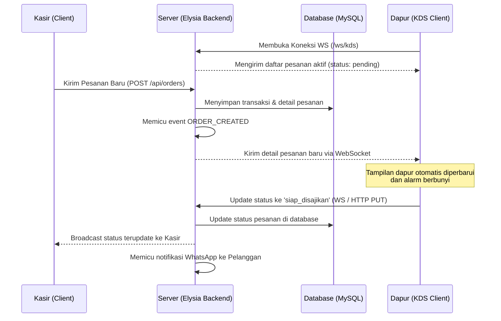
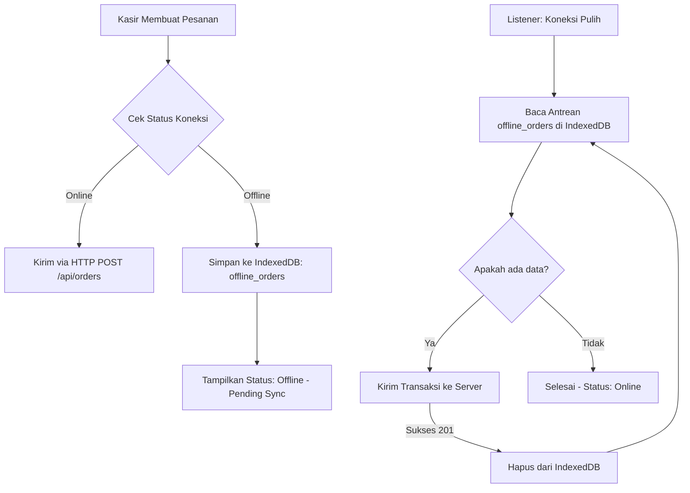

# Spesifikasi Desain: Kitchen Display System (KDS) & Mode Kasir Offline (Milestone 3)

Dokumen ini mendefinisikan arsitektur, desain komponen, alur data, penanganan error, dan rencana verifikasi untuk implementasi **Kitchen Display System (KDS) Real-Time** dan **Mode Kasir Offline-First** pada aplikasi MaKasir.

---

## 1. Arsitektur & Alur Data

### 1.1 Kitchen Display System (KDS) Real-Time
KDS menggunakan protokol WebSocket bawaan Elysia untuk komunikasi *real-time* dua arah antara aplikasi Kasir, Server Backend, dan Layar Dapur.



### 1.2 Mode Kasir Offline-First dengan Dexie.js
Ketika terjadi gangguan jaringan, kasir harus tetap bisa melayani pesanan. Data disimpan di browser menggunakan **IndexedDB** melalui pustaka **Dexie.js**.



---

## 2. Desain Database & Skema

### 2.1 Skema Database Lokal Browser (Dexie.js)
```typescript
import Dexie, { type Table } from 'dexie';

export interface LocalProduct {
  id: number;
  name: string;
  price: number;
  category: string;
}

export interface LocalOrder {
  id?: number;
  clientUuid: string; // Idempotency key
  cashierId: number;
  items: {
    productId: number;
    qty: number;
  }[];
  createdAt: Date;
}

class MaKasirLocalDB extends Dexie {
  products!: Table<LocalProduct>;
  offline_orders!: Table<LocalOrder>;

  constructor() {
    super('MaKasirLocalDB');
    this.version(1).stores({
      products: 'id, name, category',
      offline_orders: '++id, clientUuid, createdAt'
    });
  }
}

export const db = new MaKasirLocalDB();
```

### 2.2 Perubahan Skema Database Server (MySQL)
Untuk mendukung mekanisme *idempotency* (mencegah duplikasi pesanan yang dikirim ulang saat sinkronisasi):
* Menambahkan kolom `clientUuid` (VARCHAR(36), unik, opsional) ke tabel `orders`.

---

## 3. Komponen & Antarmuka (Frontend Vue 3)

### 3.1 Komponen Status Jaringan (`NetworkStatus.vue`)
* Badge visual di pojok kanan atas aplikasi kasir yang mendeteksi status internet menggunakan `navigator.onLine`.
* Menampilkan teks:
  * **Online** (Warna Hijau) saat terhubung.
  * **Offline - X Transaksi** (Warna Oranye) saat terputus, menampilkan total transaksi yang mengantre di IndexedDB.

### 3.2 Tampilan Kitchen Display System (`KitchenView.vue`)
* Kolom antrean pesanan aktif yang terurut dari pesanan paling lama masuk.
* Setiap kartu pesanan dilengkapi:
  * ID pesanan dan nama kasir.
  * Daftar pesanan beserta jumlahnya.
  * **Dynamic Timer Alert**:
    * Hijau: Menunggu < 10 menit.
    * Kuning: Menunggu 10–20 menit.
    * Merah: Menunggu > 20 menit (Peringatan lambat).
  * Tombol **"Selesai & Sajikan"** untuk mengubah status pesanan.
* Fitur audio alarm berupa bunyi bel ketika WebSocket menerima tipe pesan `'new_order'`.

---

## 4. Penanganan Error & Skenario Kritis

1. **Pencegahan Duplikasi (Idempotency)**:
   Setiap pesanan offline diberi UUID unik. Server akan melakukan pengecekan `Order.findOne({ where: { clientUuid } })` sebelum menyimpan. Jika data sudah ada, server langsung mengembalikan respons sukses 201 untuk mencegah duplikasi pesanan.
2. **Koneksi WebSocket Terputus**:
   Klien KDS Vue 3 diimplementasikan dengan logika *auto-reconnect* dengan interval berlipat ganda (*exponential backoff*). Saat berhasil tersambung kembali, KDS akan mengambil ulang data pesanan aktif terbaru dari server.
3. **Internet Terputus Saat Sinkronisasi**:
   Apabila koneksi terputus di tengah proses sinkronisasi antrean, proses loop dihentikan sementara tanpa merusak data antrean yang tersisa di IndexedDB.

---

## 5. Rencana Verifikasi

### 5.1 Pengujian Manual
* **Uji Kasir Offline**:
  1. Set koneksi browser ke mode offline melalui Chrome DevTools.
  2. Lakukan transaksi, pastikan data tersimpan di IndexedDB dan badge status berubah.
  3. Kembalikan koneksi ke online, pastikan transaksi terkirim dan IndexedDB bersih kembali.
* **Uji KDS Real-Time**:
  1. Buka halaman kasir dan KDS di dua jendela browser berdampingan.
  2. Selesaikan transaksi di kasir, pastikan KDS memunculkan pesanan baru secara instan disertai bunyi bel notifikasi.
  3. Klik tombol "Selesai" di KDS, pastikan pesanan tersebut berpindah kolom dan status di database terupdate.

### 5.2 Pengujian Otomatis
* Membuat pengujian unit menggunakan Bun test runner pada `test/kds.test.ts` untuk memverifikasi fungsionalitas WebSocket Server Elysia.
