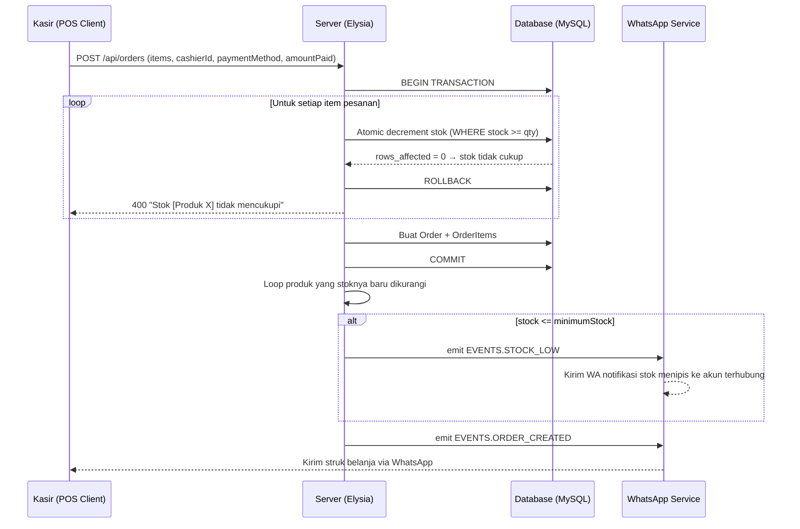

# Spesifikasi Desain: Manajemen Stok & Keuangan Dasar (Milestone 1)

Dokumen ini mendefinisikan arsitektur, desain komponen, alur data, penanganan error, dan rencana verifikasi untuk implementasi **Manajemen Stok Barang**, **Metode Pembayaran & Kembalian**, **Peringatan Stok Menipis via WhatsApp**, dan **Pencatatan Pengeluaran Toko** pada aplikasi MaKasir.

---

## 1. Arsitektur & Alur Data

### 1.1 Manajemen Stok & Peringatan Stok Menipis (Fitur 2 & 12)

### 1.2 Metode Pembayaran & Kembalian (Fitur 5)

- Jika `paymentMethod === 'cash'`:
  - Validasi: `amountPaid >= totalPrice`, jika tidak → HTTP 400.
  - `changeDue = amountPaid - totalPrice` dihitung di server dan disimpan ke DB.
- Jika `paymentMethod === 'qris'`:
  - `amountPaid` dan `changeDue` diabaikan (bernilai `null`).
- Struk WhatsApp diperbarui untuk menyertakan baris: Metode Pembayaran, Uang Diterima, dan Kembalian.

### 1.3 Pencatatan Pengeluaran (Fitur 13)

- Model baru `Expense` dengan kolom: `id`, `description`, `amount`, `category`, `createdBy` (FK → users), `createdAt`.
- Otorisasi:
  - **GET / POST**: Semua user terautentikasi (`requireAuth`).
  - **PUT / DELETE**: Hanya Admin (`requireAdmin`).

---

## 2. Perubahan Skema Database

### 2.1 Tabel `products` (Tambahan Kolom)
| Kolom | Tipe | Default | Keterangan |
|---|---|---|---|
| `stock` | INTEGER | 0 | Jumlah stok saat ini |
| `minimumStock` | INTEGER | 5 | Batas minimum untuk notifikasi |

### 2.2 Tabel `orders` (Tambahan Kolom)
| Kolom | Tipe | Default | Keterangan |
|---|---|---|---|
| `paymentMethod` | STRING | `'cash'` | `'cash'` atau `'qris'` |
| `amountPaid` | FLOAT | null | Uang yang diterima dari pelanggan |
| `changeDue` | FLOAT | null | Kembalian yang harus diberikan |

### 2.3 Tabel `expenses` (Baru)
| Kolom | Tipe | Keterangan |
|---|---|---|
| `id` | INTEGER (PK, AI) | Primary key |
| `description` | STRING | Keterangan pengeluaran |
| `amount` | FLOAT | Nominal pengeluaran |
| `category` | STRING | Kategori (Operasional, Bahan Baku, dll) |
| `createdBy` | INTEGER (FK) | ID user yang mencatat |
| `createdAt` | DATE | Timestamp otomatis |

---

## 3. Komponen Backend

### [MODIFY] `models/Product.ts`
- Tambah deklarasi `declare stock: number` dan `declare minimumStock: number`.
- Tambah kolom `stock: { type: DataTypes.INTEGER, defaultValue: 0 }` dan `minimumStock: { type: DataTypes.INTEGER, defaultValue: 5 }`.

### [MODIFY] `models/Order.ts`
- Tambah deklarasi `paymentMethod`, `amountPaid`, `changeDue`.
- Tambah kolom di `Order.init`.

### [NEW] `models/Expense.ts`
- Model Sequelize baru dengan tabel `expenses`.

### [MODIFY] `models/index.ts`
- Import dan export `Expense`.
- Tambah relasi: `Expense.belongsTo(User, { as: 'creator', foreignKey: 'createdBy' })`.

### [MODIFY] `services/event.service.ts`
- Tambah konstanta `STOCK_LOW: 'stock_low'` ke objek `EVENTS`.

### [MODIFY] `services/whatsapp.service.ts`
- Tambah listener `EVENTS.STOCK_LOW` untuk mengirim notifikasi stok menipis.
- Update template pesan `EVENTS.ORDER_CREATED` untuk menyertakan metode pembayaran, uang diterima, dan kembalian.

### [NEW] `controllers/ExpenseController.ts`
- `getAll()`: Ambil semua pengeluaran, urut dari terbaru.
- `create(data)`: Buat pengeluaran baru, simpan `createdBy` dari user yang login.
- `update(id, data)`: Update deskripsi/nominal/kategori. Hanya bisa diakses Admin.
- `delete(id)`: Hapus pengeluaran. Hanya bisa diakses Admin.

### [MODIFY] `controllers/OrderController.ts`
- Terima `paymentMethod` dan `amountPaid` dari `data`.
- Validasi `amountPaid >= totalPrice` jika `paymentMethod === 'cash'`.
- Gunakan **atomic decrement** untuk pengurangan stok.
- Hitung dan simpan `changeDue`.
- Setelah commit, emit `EVENTS.STOCK_LOW` untuk produk yang stoknya ≤ `minimumStock`.

### [MODIFY] `index.ts`
- Update skema body `POST /api/orders` untuk menerima `paymentMethod` dan `amountPaid`.
- Tambah 4 endpoint baru di group authenticated dan admin untuk `/api/expenses`.

---

## 4. Komponen Frontend

### [NEW] `views/Expenses.vue`
- Tabel daftar pengeluaran: Deskripsi, Kategori, Nominal, Dicatat oleh, Tanggal.
- Ringkasan: Total Pengeluaran Hari Ini & Total Bulan Ini.
- Form modal untuk tambah pengeluaran baru (semua user).
- Tombol Edit & Hapus hanya tampil untuk Admin.

### [MODIFY] `views/POS.vue`
- Toggle metode pembayaran (Tunai / QRIS) di sidebar keranjang.
- Input `amountPaid` (hanya tampil saat memilih Tunai).
- Display kembalian realtime yang dihitung di frontend.
- Kirim `paymentMethod` dan `amountPaid` ke API saat checkout.

### [MODIFY] `views/Admin/Products.vue`
- Tambah kolom `Stok` dan `Min. Stok` di tabel.
- Tambah input `stock` dan `minimumStock` di form tambah/edit produk.

### [MODIFY] `components/DashboardLayout.vue`
- Tambah link navigasi `💸 Pengeluaran` di sidebar.

### [MODIFY] `router/index.ts`
- Daftarkan rute `/expenses` → `Expenses.vue`.

---

## 5. Penanganan Error

| Skenario | Penanganan |
|---|---|
| Stok habis saat checkout (race condition) | Atomic SQL decrement: rollback jika `rows_affected = 0` |
| `amountPaid` < `totalPrice` (pembayaran tunai) | HTTP 400: "Uang yang diterima tidak mencukupi" |
| Kasir mencoba DELETE /api/expenses/:id | HTTP 403 Forbidden via `requireAdmin` middleware |
| Produk dihapus (stok ikut terhapus) | Sequelize cascade / FK constraint |

---

## 6. Rencana Verifikasi

### Manual
1. Set stok produk = 2, pesan qty = 3 → pastikan error stok tidak cukup.
2. Pesan qty valid → cek stok di halaman Admin berkurang sesuai.
3. Set `minimumStock = 5`, `stock = 6`, pesan qty = 2 → pastikan notifikasi WA stok menipis terkirim.
4. Checkout tunai Rp 30.000 dengan total Rp 25.000 → pastikan kembalian Rp 5.000 muncul di respons dan struk WA.
5. Kasir tambah pengeluaran → berhasil. Kasir hapus → ditolak (403). Admin hapus → berhasil.
